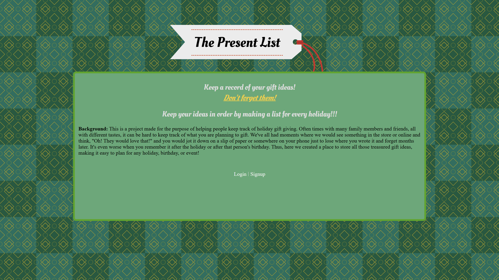
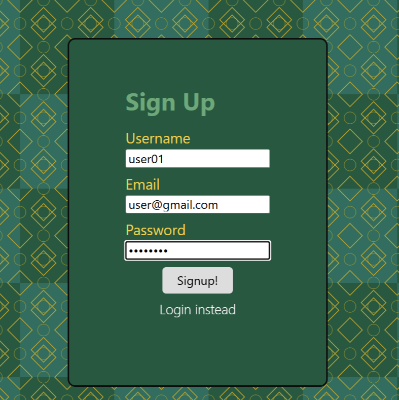
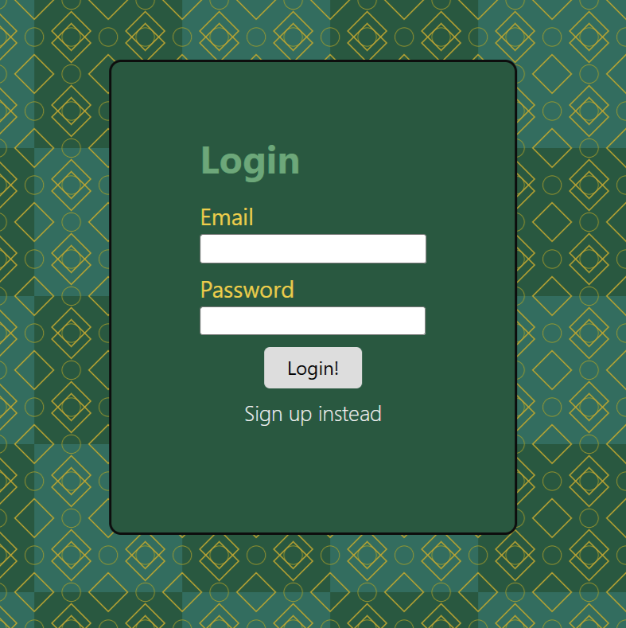
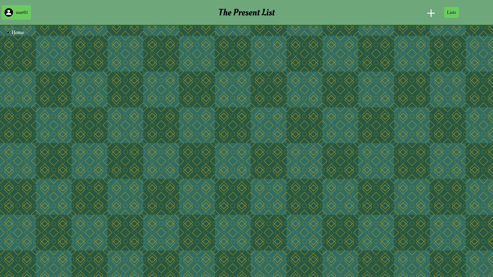

# Present List

By Shane Mindreau, Affan Kamal, and Joseph Aro

Deployed App With Heroku: [Present List App](https://present-list-fc60525bdd4f.herokuapp.com/)

## Description

This is a holiday organizer. On this application you are able to create multiple lists for different holidays and be able to track the people you want to get presents for, the date you want to exchange the present, the price for the present and what type of present you want to get.

## Table of Contents

- [Installation](#installation)
- [Usage](#usage)
- [Mock Images](#mock-images)
- [Credits](#credits)
- [License](#license)
- [Badges](#badges)
- [Features](#features)
- [Tests](#tests)

## Installation

- Installation is simple. All you need to do is clone the GitHub repository and install Node if you do not already have it.
- From there do an npm install to get the necessary packages if you are running it locally.
- Next you will need to set up your database. We used 'MySQL Workbench 8.0 CE' but you may use whatever you have that can set up a MySQL database. Once you have set up the 'MySQL Connection'/'instance' in Workbench or your platform, run the code in the schema.sql within Workbench/your platform. This will create the database that the app will run on.
- If you would like, you can seed the database by creating a demo user. This can be done by running the code within the seed.sql file, located in the db folder.
- Now, the 'MySQL Connection'/'instance' that holds your database should be running on a specific port. It is normally displayed before you click on the 'instance'. For us it was 3306, yours may be the same or it may be different. If it is different you will need to enter the connection.js file located in the config folder, and on line 16 replace the number for "port" with your own.
- If you are running it locally you will also need to create a .env and in it assign values to the keys DB_NAME, DB_PASSWORD, DB_USER, and SESS_SECRET. The DB_NAME will be the name of the database you created. If you ran the code in schema.sql within Workbench or your platform, then the database's name will be 'present_db'. So, you would set DB_NAME='present_db'. The DB_PASSWORD and DB_USER will be what you set as the password and username for your 'MySQL Connection'/'instance'. Lastly, the SESS_SECRET can be set to any string. It is simply an identifier for the session that your database uses.
- If you are planning on deploying the app, then you will need to make sure your .env values are included on your hosting site's settings. Some hosting sites like Heroku will need you to set these up in the config settings of the deployed app.

## Usage

- On the homescreen either click 'Signup' to be brought to the signup page, or login, if you have already made an account.
- Once logged in, click the "+" button to create a new list.
- Click "list" tab on the top right of the page to view all your lists and select the list you want to view or edit.
Once you select your list, click "add row" button to add a row to the list.
- Make any changes you wish to the title or the contents of the list and click save to save your changes.
- If you wish to delete a row simply click on the trash icon of your chosen row.
- If you wish to delete a lsit, simply load the list you wish to delete and click the button 'Delete Current List'.
- If you close out the tab without logging out then you will remain logged in whenever you revisit the page until your session expires two days later. After which you will need to log in again.
- If you wish to log out, simply click on the user icon on the top left which displays your username and a logout button will appear.

## Mock Images

The following images show the web application's appearance and functionality:

  
  

  
  

## Credits

For this project we utilized Node.js, using the npm packages:
- connect-session-sequelize, 7.0.4
- dotenv: 16.4.5
- express: 4.21.0
- express-handlebars: 5.2.0
- express-session: 1.18.1
- mysql2: 3.11.3
- long: 5.2.3 (A necessary package, used by mysql2's package)
- sequelize: 6.37.3

## License

MIT License

## Badges

N/A

## Features

You can create and delete lists, and edit each list as you like to keep track of who you want to gift a present, what present it is, when to gift it, and how much it costs.

## Tests

There currently are no tests set up for this app's code.
